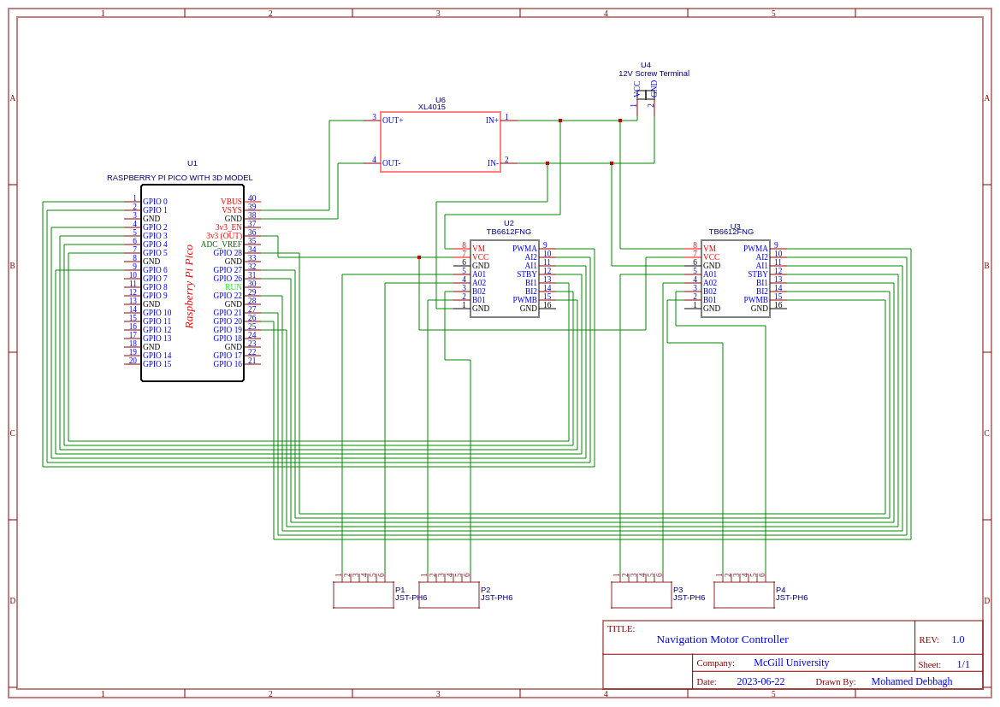

# RPI PICO Motor Driver

This is the Raspberry Pi Pico firmware used for the motor driver control.

Used in the Following Compatible Robot:
- Cotton Rover (2022/2023 Mac Robotics)

## Interface
USB Serial: Typically ⇾ /dev/ttyACM0

**Serial communication format** Send the following command to /dev/ttyAMC0--> 'direction:{direction};speed:{speed}'

### List of Commands
- **Available directions:** 'forward', 'backward', 'right', 'left', 'rotate_right', 'rotate_left', 'stop'

- **Available speeds:** 0-100  (note that motor start rotating around 30)

## Motor Driver Schematic (Last updated: 2023/10/27)

